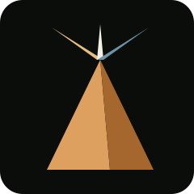

  

  <h1>FreemanLabs</h1>
  
<strong>One idea in. Every niche out.</strong>

  

    
    
  

---

## What FreemanLabs is

FreemanLabs is an AI-driven video content studio. From a simple editorial
brief — a topic, a tone, a target platform — the platform produces a
finished video: script, visuals, voice, animation and editing, with no
manual work on the production itself.

This isn't a prototype. It's the real infrastructure behind an active
YouTube channel: every published video comes directly out of this
pipeline, from brief to publication.

## Proof, not promises

| | |
|---|---|
| **104** | videos produced in a single night, unsupervised |
| **5 steps** | script → visuals → voice → animation → editing, fully automated end to end |
| **1 → ∞** | one pipeline, built to adapt to any editorial niche |

## See it in action

<table>
  <tr>
    <td width="33%" align="center">
       
      The hidden number 90% of gamers ignore
    </td>
  </tr>
</table>

More coming soon on the <a href="https://www.youtube.com/@BenoitFreeman">pilot channel</a>.

## The vision

FreemanLabs' technical layer — orchestration, visual continuity, production
reliability — is independent of any specific niche. The bet: turn a content
studio already validated in real-world conditions into a platform open to
creators, agencies and brands who want to produce content at a pace no
human team can sustain alone.

## About this repository

This repository is a **public showcase**: it presents the project, not how
it works. FreemanLabs' source code, workflows and technical architecture
remain private.

Interested in a partnership, a pilot access or an investment conversation?

- **Contact**: Discord — `benoitfreeman`
- **Pilot channel**: [@BenoitFreeman on YouTube](https://www.youtube.com/@BenoitFreeman)

---

  © 2026 FreemanLabs — all rights reserved. See <a href="LICENSE.md">LICENSE.md</a>.

